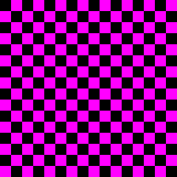
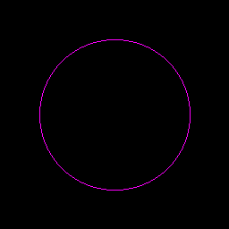

# Second Attempt to Implement [Midpoint Circle Algorith](https://en.wikipedia.org/wiki/Midpoint_circle_algorithm) (2021, colorized)

No dependencies. Single self-contained rust file. Visualization is done via outputing [PPM images](https://en.wikipedia.org/wiki/Netpbm)

## Quick Start

```console
$ rustc main.rs
$ ./main
```

The program will generate a bunch of PPM files with different patterns including solid and hollow circles. You will need an image viewer that supports the PPM format. I used [feh](https://feh.finalrewind.org/) and it worked well enough. Also [ImageMagick](https://imagemagick.org/index.php) can convert PPM files.

## Screenshots

These are just random patterns we used to test the renderer out:

 

Here are the circles. Both solid and hollow:

 
